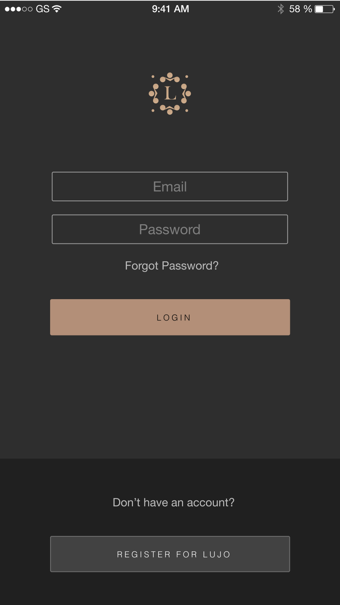

# LUJO

> Lujo is your ultimate concierge app providing premier services all over the world, including:

[![Swift Version][swift-image]][swift-url]
[![Build Status][circleci-image]][circleci-url]
[![Platform][ios-platform]][ios-url]
[![Dependencies][spm-image]][spm-url]

## Version

1.0

## About LUJO

- Restaurant reservations at highly popular restaurants.
- Ability to request Yacht charters.
- Ability to request flights (commercial and private).
- Ability to request Villas and Hotels.
- Ability to request tickets at highly popular events.
- Ability to request high demand products.

By signing up and downloading Lujo, you will have access to a world of exclusive content at your finger tips.

Lujo comes from a demand for the exceptional. In the high-pressured time pressed lifestyles of today, it’s sometimes hard to appreciate the possibility that exists. Lujo was pioneered and created by a team of high flyers, from the world of business, technology and beyond. It came from an idea that the role of a personal assistant and concierge can be redefined. Rather than being about us, Lujo is about you.

## Features

- [x] Login screen
- [ ] Discover Screen
- [ ] Template for Experiences
- [ ] Experiences data layer
- [ ] Experiences Details
- [ ] Experiences Details data layer
- [x] Filter screen
- [x] Apply filter
- [ ] Search data layer
- [ ] Booking process
- [ ] External plugins
- [x] Account settings
- [ ] Social Network
- [x] Chat Functionality

## Build and Runtime Requirements
+ Xcode 9.4 or later
+ iOS 11.0 or later
+ macOS v10.10 or later
+ iCloud-enabled provisioning profile

## Configuring the Project

### Carthage

Added Carthage as dependency manager. First thing to do is to run _carthage update_ so it can fetch the frameworks needed to run the app.

The frameworks used by LUJO App are:

- [Alamofire](https://github.com/Alamofire/Alamofire)
- [ObjectMapper](https://github.com/Hearst-DD/ObjectMapper)
- [DefaultsKit](https://github.com/nmdias/DefaultsKit)
- [RxSwift](https://github.com/ReactiveX/RxSwift)
- [M13Checkbox](https://github.com/Marxon13/M13Checkbox)
- [ActiveLabel](https://github.com/optonaut/ActiveLabel.swift)
- [SwiftEntryKit](https://github.com/huri000/SwiftEntryKit)
- [JGProgressHUD](https://github.com/JonasGessner/JGProgressHUD)

## Application Architecture

## Meta

LUJO LLC - [@baroqueaccess](https://twitter.com/baroqueaccess) - frontend@golujo.com

[swift-image]:https://img.shields.io/badge/swift-4.0-orange.svg?longCache=true&style=flat
[swift-url]: https://swift.org/
[circleci-image]: https://img.shields.io/circleci/project/github/RedSparr0w/node-csgo-parser.svg
[circleci-url]: https://travis-ci.org/dbader/node-datadog-metrics
[ios-platform]: https://img.shields.io/badge/ios-11.0-brightgreen.svg?longCache=true&style=flat
[ios-url]: https://developer.apple.com/ios/
[spm-image]: https://img.shields.io/badge/swift%20package%20manager-compatible-blue.svg?longCache=true&style=flat
[spm-url]: https://github.com/apple/swift-package-manager

